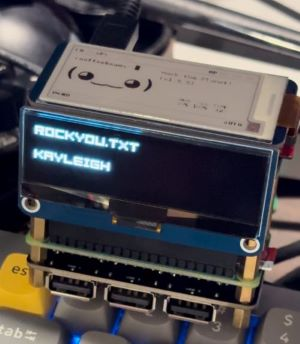

# CrackiGotchi

# Materials
(x1) [Raspberry Pi Zero WH](https://amzn.to/49mZVxC) 
(x1) [Raspberry Pi Zero 2 WH](https://amzn.to/3Ov69Dm) 
(x2) [Micro SD Cards](https://amzn.to/48bSKY8) 
(x1) [2.13-inch e-ink Waveshare 4 display](https://amzn.to/3HTGT6h) 
(x1) [2.23inch OLED HAT](https://amzn.to/3V2gCKb) 
(x1) [Battery pack](https://amzn.to/4e2aQzL) 
(x1) [90-degree GPIO extenders & splitter](https://amzn.to/3Uooea9) 
[Stand-off brackets](https://amzn.to/3St6NSX) 
 
_(Amazon affiliate links)_ 

# **[Watch the Build](https://www.reddit.com/u/froggyCaller/s/En8RwPh16d)**

## **Installations**

1. **OS install:**
   - Raspberry Pi Zero WH - [Pwnagotchi](https://pwnagotchi.ai/installation/)  
   - Raspberry Pi Zero 2 WH - Pi OS Lite 64-bit

2. Set up 2.23inch OLED HAT (on Zero 2 W) 

    _[Source](https://www.waveshare.com/wiki/2.23inch_OLED_HAT)_
   
 
